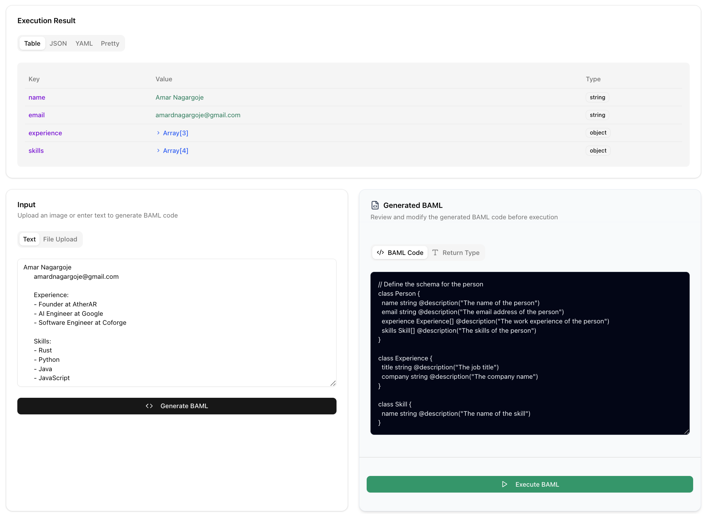
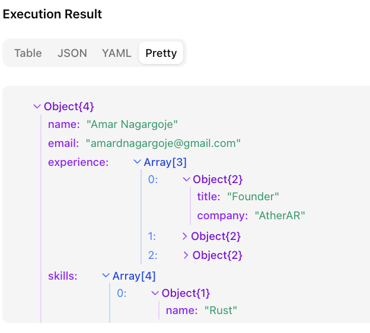
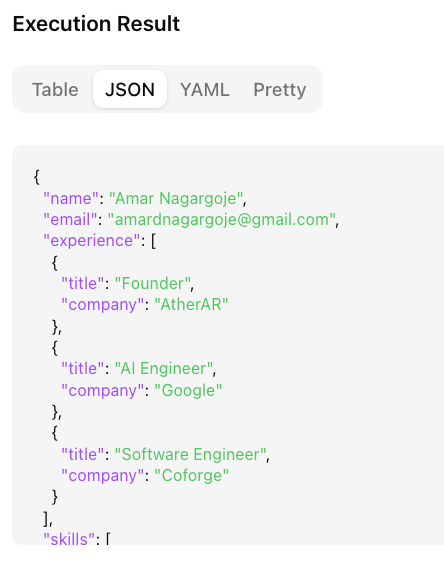

# 🧠 Extract Anything and generate code with BAML + Modal (LLM-Powered)

> Generate and execute dynamic extraction pipelines using BAML, powered by a modal-deployed `llama-3.2-11b` vision LLM.


## ✨ Overview

This project showcases an **end-to-end full stack application** that can extract structured data from **unstructured content (text, images, or PDFs)** — without knowing the schema in advance.  
The system uses:

- 🧠 **BAML** for defining and executing dynamic schemas
- 🔁 **Streaming API** for real-time feedback
- 🧑‍💻 **FastAPI + React (Next.js)** for backend/frontend
- 🚀 **Modal** for serving a custom fine-tuned LLaMA 3.2 vision LLM

---

## Output



## Code Generated

### Object


### Json


---

## 🧩 How It Works

1. **Input any unstructured data** – resume, receipt, document, etc.
2. The **LLM proposes a schema** using `GenerateBAML`.
3. A dynamic schema is built with BAML's `TypeBuilder`.
4. We then **extract values using the generated schema** with `ExecuteBAML`.
5. Final results are shown in JSON, table, YAML formats on the frontend.


## ⚙️ Architecture

```text
        ┌────────────┐
        │   Client   │
        │ (Next.js)  │
        └─────┬──────┘
              │
              ▼
        ┌────────────┐
        │ FastAPI 🐍 │  <- Python Backend
        └─────┬──────┘
              │
      ┌───────▼─────────┐
      │ BAML TypeBuilder│
      │ + Dynamic Exec  │
      └───────┬─────────┘
              │
              ▼
     ┌──────────────────────┐
     │ Modal (LLaMA-3.2-11B)│ <- Vision LLM
     └──────────────────────┘

```

## Setup
1. run `make setup` (make sure you have `uv` and `npm` installed)
2. install the baml vscode extension (at the version of baml you have installed. They must match!)
3. create a modal account and login: `uv run modal setup` and `uv run modal token new`
4. run `make modal-deploy` to deploy your LLM 
5. go to [clients.baml](./baml_src/clients.baml) and update the value for `YOUR_MODAL_APP_URL` with the url provided to your app (should be something like `https://{your-modal-account-name}--llama-3-2-11b-vision-serve.modal.run`). Keep the `/v1` in the url in clients.baml